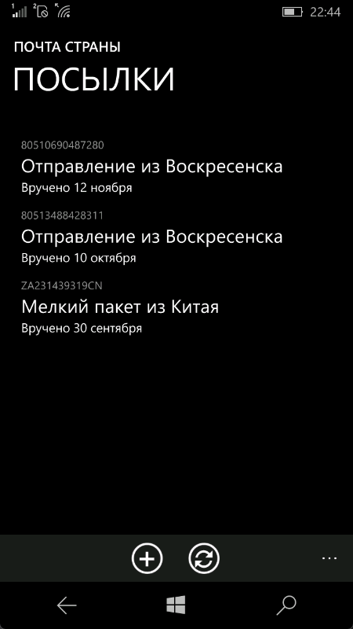

# Почта Страны

Клиент "Почты России" для устройств на Windows Phone 8.1 и Windows 10 Mobile. Поддерживается с WP8 и выше. 

В Releases программа не подписана, нужно подписать или ставить в Developer Mode (например, через CMD Injector).

## Скриншоты

## Хочу это забилдить

Убедитесь, что у вас

- Есть компьютер Windows 8.1
- Установлен Visual Studio 2015 Community Edition (скачать можно [тут](https://archive.org/details/vs2015.3.com_enu_202102&e=124743917) например)
- Играть в наушниках THRILL PILL (не обязательный шаг)
